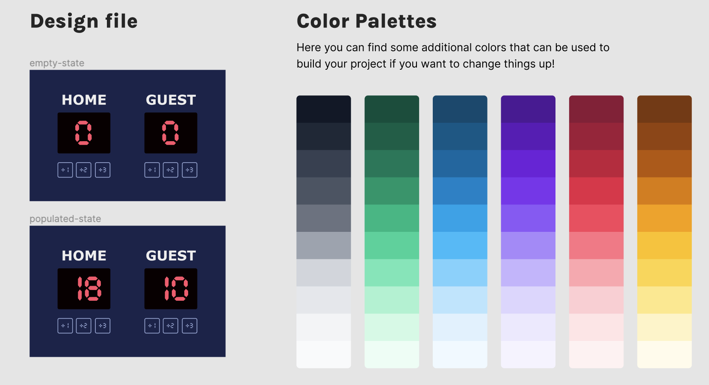

# Basketball Scoreboard

This project is a Basketball Scoreboard web application built as part of the Scrimba Front End Developer Path. The app was developed using a Figma design provided as part of the challenge. The design was fully implemented to create a responsive and functional basketball scoreboard.

## Table of Contents

- [Features](#features)
- [Design and Style](#design-and-style)
- [Usage](#usage)
- [Credits](#credits)
- [License](#license)
- [Questions](#questions)

## Features

- **Score Tracking**: Users can update the score for the home and guest teams with +1, +2, and +3 point increments.
- **Foul Tracking**: Each team's fouls can be tracked and displayed.
- **Game Timer**: Includes a running game timer with start, pause, resume, and reset functionalities.
- **Responsive Design**: The application layout adjusts for various screen sizes ensuring usability across devices.

## Design and Style

The visual style and layout of this application are based on a Figma design provided in the [Scrimba](https://scrimba.com/learn/frontend). The CSS for the application is crafted to closely match this design, ensuring a seamless visual experience that mirrors the proposed aesthetics and functionality. This includes the application of specific fonts, colors, and layout adjustments responsive to different device screens. The design's adherence to modern UI principles facilitates a user-friendly interface that is both functional and visually appealing.

## Usage

To use the Basketball Scoreboard:

1. Visit [Basketball Scoreboard](https://adriannaderkacz.github.io/basketball-scoreboard/) to access the web app directly from your web browser. 
2. Use the "+1", "+2", "+3" buttons under each team's section to add points to the respective team's score.
3. Track fouls by using the "+1 foul" button under each team's fouls section.
4. Control the game timer using the "New Game", "Pause", "Resume", and "Reset" buttons at the bottom of the screen.

The application is straightforward and does not require any installation, as it can be run directly from a browser.

## Credits

- **Background Picture:** The background image used in this project is sourced from [Unsplash](https://unsplash.com/photos/red-and-white-abstract-painting-O2kqxbix4Mw).
- **Project Idea:** [Scrimba Frontend Career Path](https://scrimba.com/learn/frontend).
- **Design:** Design idea was provided by [Scrimba](https://scrimba.com/learn/frontend). 

## License
  MIT License

  Copyright (c) [2024] [AdriannaDerkacz]

  Permission is hereby granted, free of charge, to any person obtaining a copy of this software and associated documentation files (the "Software"), to deal in the Software without restriction, including without limitation the rights to use, copy, modify, merge, publish, distribute, sublicense, and/or sell copies of the Software, and to permit persons to whom the Software is furnished to do so, subject to the following conditions:

  The above copyright notice and this permission notice shall be included in all copies or substantial portions of the Software.

  THE SOFTWARE IS PROVIDED "AS IS", WITHOUT WARRANTY OF ANY KIND, EXPRESS OR IMPLIED, INCLUDING BUT NOT LIMITED TO THE WARRANTIES OF MERCHANTABILITY, FITNESS FOR A PARTICULAR PURPOSE AND NONINFRINGEMENT. IN NO EVENT SHALL THE AUTHORS OR COPYRIGHT HOLDERS BE LIABLE FOR ANY CLAIM, DAMAGES OR OTHER LIABILITY, WHETHER IN AN ACTION OF CONTRACT, TORT OR OTHERWISE, ARISING FROM, OUT OF OR IN CONNECTION WITH THE SOFTWARE OR THE USE OR OTHER DEALINGS IN THE SOFTWARE.

  ## Questions
  For questions, please contact me at a.derkacz@gmail.com.
  GitHub: [adriannaderkacz](https://github.com/adriannaderkacz).